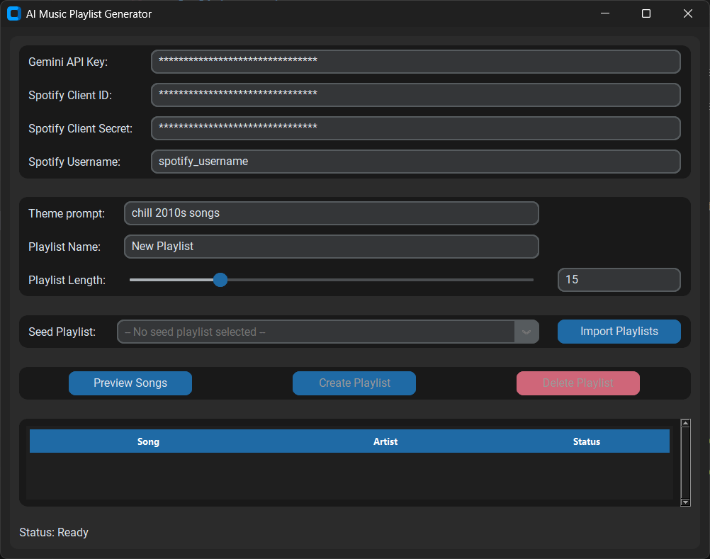

# 🎶 AI Playlist Generator UI
Generate playlists from a seed playlist and text input.



## ✨ Features

- Generate a playlist with AI
- Customizable seed playlist
- Load personal playlists from music providers (Spotify, ~~Tidal~~, ~~SoundCloud~~, ~~YouTube~~)
- Input a theme prompt
- Customize new playlist length (int) with a slider (1, 50) or custom input

## 🚀 Installation
To get started, follow these steps:

Clone the repository:
```
git clone https://github.com/CelestialSource/ai-playlist-generator
cd ai-playlist-generator
pip install -r requirements.txt
```
## 🎮 Usage
Once the installation is complete, you can run the application:
```
py main.py
```
## 🛠️ Libraries/Tools
Python: The core programming language.<br>
Interals: threading, json, os<br>
AI: google-genai<br>
Music: spotipy<br>
UI: customtkinter, tkinter, messagebox<br>